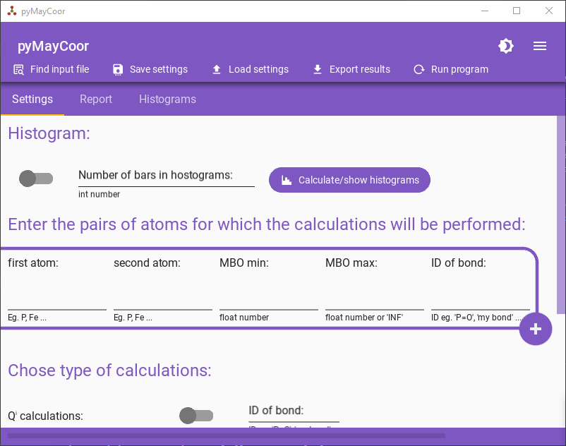

## The current library allows you to process Mayer bond orders from the CPMD output file

Library version: 1.1.0

<!-- Pytest Coverage Comment:Begin -->
\n<!-- Pytest Coverage Comment:End -->

### Links

- [Documentation page](https://pawelgoj.github.io/pyMayCoor/bond_order_processing)
- [Git repository](https://github.com/pawelgoj/pyMayCoor/tree/pypi/main/BondOrderProcessing)
- More information about CPMD - <https://github.com/CPMD-code>

### You can calculate from Mayer bond orders

- coordinations numbers,
- Qi units,
- Connections between atoms,
- Relation between bond order and length,
- Covalence (The sum of the bond orders of a given atom. This  value is close to the valence if atom have only purely covalent bonds)

### You can also use application using this library.

Check: https://github.com/pawelgoj/pyMayCoor

